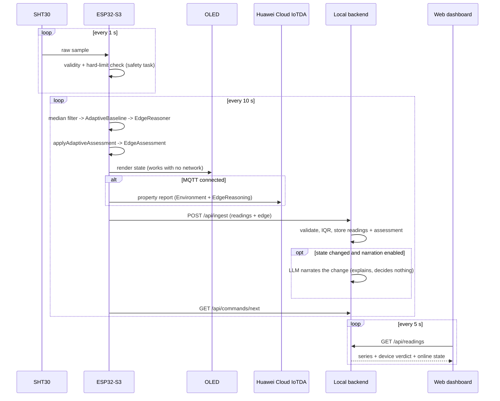

# Data Flow

End-to-end path from an SHT30 sample to the OLED, the cloud, and the dashboard.

## The decision path (no network)

```text
SHT30
  -> safety task, 1 Hz: physical validity + hard limits
  -> median filter
  -> AdaptiveBaseline.observe()
  -> EdgeReasoner.add() + assess()
  -> applyAdaptiveAssessment()
  -> EdgeAssessment
  -> OLED
  -> buzzer, if a local threshold is crossed
```

Every step runs on the ESP32-S3. There is no network call anywhere in it, so
the device behaves identically whether or not Wi-Fi is up.

## The reporting path (network)

The same assessment leaves the device over two independent transports, each on
its own interval — the local one is free and fast, the cloud one is metered and
slow:

```text
EdgeAssessment
  ├─ MQTT/MQTTS -> Huawei Cloud IoTDA
  │    $oc/devices/{device_id}/sys/properties/report
  │    services: [Environment, EdgeReasoning]
  │
  └─ HTTP POST -> local backend /api/ingest
       -> validate ranges and device allowlist
       -> IQR outlier detection over the sliding window
       -> SQLite: sensor_readings, edge_assessments, anomaly_events
       -> optional LLM narration (only on state change)
       -> GET /api/readings -> local dashboard (dev/verification view)
```

Either path can fail without affecting the other, and neither can affect the
decision that was already made.

## Step by step

1. The safety task reads the SHT30 every second and checks physical validity and
   fixed hard limits. A breach is latched immediately.
2. The same task evaluates the local alarm thresholds. Crossing one sounds the
   buzzer and puts the reason and the actual numbers on the OLED. This runs in
   the safety task, not `loop()`, so it does not wait for `setup()` to finish
   connecting to Wi-Fi, NTP and MQTT — an environment already over threshold at
   power-on would otherwise wait more than thirty seconds for a beep.
3. Every `senseIntervalMs` — 2 s when anything is happening, stretching toward
   10 s in a calm room — the main loop takes the latest safety snapshot. If it
   is older than 1.5 s, reporting is blocked rather than sending a stale value.
   Note that this is the *processing* interval, not the sampling rate: the
   sensor is still read once a second above, because sampling rate is alarm
   latency.
4. The reading is median-filtered, then observed by `AdaptiveBaseline`.
5. `EdgeReasoner` is fed on its own fixed 10 s cadence, so its 12-sample window
   keeps spanning 2 minutes however the reporting interval is currently
   varying, and assesses.
6. `applyAdaptiveAssessment()` overlays the baseline result — `HARD_LIMIT`
   overrides everything, `BASELINE_SHIFT` applies only when the fixed layer said
   `NORMAL`.
7. The OLED is updated. This happens regardless of network state.
8. Every 60 s (`CLOUD_INTERVAL_MS`), if MQTT is connected, one combined message
   publishes both services to IoTDA — the only metered path.
9. `HttpClient::postSensorData()` sends readings and the `edge` object to the
   local backend, with exponential backoff (10 s doubling to 5 min) on failure.
10. The backend validates, stores, and runs IQR detection as an independent
    second opinion. It does not alter the device's verdict.
11. `edge_assessments` records only state *transitions*, so each row's timestamp
    is when that state began.
12. If narration is enabled, a state change may trigger one LLM call to produce
    a human-readable explanation. Steady state produces no call.
13. The local dashboard, when running, polls `GET /api/readings` every 5 s and
    renders the device's verdict unchanged. Nothing depends on it — it is a way
    to watch the ingest path, not part of it.
14. The device polls `GET /api/commands/next` for queued OLED or buzzer commands
    and acknowledges them. While a local alarm is active, buzzer commands are
    refused — a real alarm is not something a network message gets to switch off.

## Sequence



## Demo flow

1. Start the backend and open the dashboard; readings and the device verdict
   appear.
2. Breathe on the sensor or warm it. The slope crosses 1.2 °C/min.
3. The OLED switches to `TEMP RISING` within one 10-second cycle.
4. The dashboard shows the same state, with confidence and the time it began.
5. **Pull the Wi-Fi, then warm the sensor past 30 °C.** The buzzer still sounds
   and the OLED still names the reason with real numbers. This is the point of
   the architecture, and it demonstrates in ten seconds.
6. Reconnect. Backoff recovers, and the backlog resumes reporting.

With no hardware available, `python3 scripts/simulate_sensor.py --interval 2`
drives the same path from a laptop.

## Failure behaviour

| Failure | What happens |
|---|---|
| Wi-Fi down | Reasoning, OLED, and safety task unaffected. Reports resume on reconnect. |
| Local recorder unreachable | Exponential backoff, 10 s doubling to 5 min, logged on serial. Nothing appears on the OLED: the recorder is a verification sink, not part of the monitoring path, and showing its absence as a device status would misrepresent what failed. |
| IoTDA/MQTT down | Retry every 5 s. The local HTTP path is independent and keeps working. |
| Sensor read fails | Reporting blocked rather than sending a bad value; OLED shows the fault. |
| Stale safety sample (>1.5 s) | Reporting blocked for that cycle. |
| Readings erratic | `UNSTABLE` / `ERRATIC_SIGNAL` — the device says the signal cannot be trusted instead of drawing a conclusion from it. |
| LLM API fails | Falls back to local Ollama; if that fails too, no narration. No alert is affected — narration is not in the decision path. |
| Everything network-side down at once | The local threshold alarm still sounds within a second, with its reason on the OLED. Nothing in that path leaves the chip. |
| Device stops reporting | Dashboard marks it offline after 30 s (three missed reports); the backend pill stays green, so the two are distinguishable. |
| NVS unavailable | Baseline learning continues in RAM, and says so on the serial log. |
