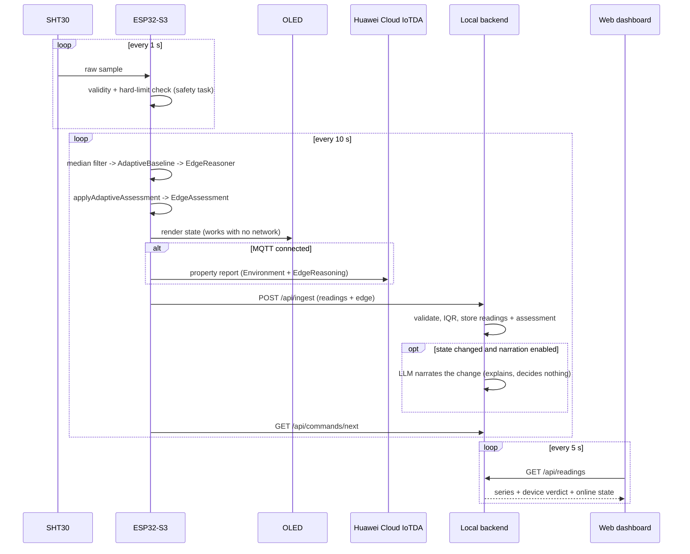

# Data Flow

End-to-end path from an SHT30 sample to the OLED, the cloud, and the dashboard.

## The decision path (no network)

```text
SHT30
  -> safety task, 1 Hz: physical validity + hard limits
  -> median filter
  -> AdaptiveBaseline.observe()
  -> EdgeReasoner.add() + assess()
  -> applyAdaptiveAssessment()
  -> EdgeAssessment
  -> OLED
```

Every step runs on the ESP32-S3. There is no network call anywhere in it, so
the device behaves identically whether or not Wi-Fi is up.

## The reporting path (network)

Once per `REPORT_INTERVAL_MS` (10 s), the same assessment leaves the device
twice, over independent transports:

```text
EdgeAssessment
  ├─ MQTT/MQTTS -> Huawei Cloud IoTDA
  │    $oc/devices/{device_id}/sys/properties/report
  │    services: [Environment, EdgeReasoning]
  │
  └─ HTTP POST -> local backend /api/ingest
       -> validate ranges and device allowlist
       -> IQR outlier detection over the sliding window
       -> SQLite: sensor_readings, edge_assessments, anomaly_events
       -> optional LLM narration (only on state change)
       -> GET /api/readings -> web dashboard
```

Either path can fail without affecting the other, and neither can affect the
decision that was already made.

## Step by step

1. The safety task reads the SHT30 every second and checks physical validity and
   fixed hard limits. A breach is latched immediately.
2. Every 10 s the main loop takes the latest safety snapshot. If it is older
   than 1.5 s, reporting is blocked rather than sending a stale value.
3. The reading is median-filtered, then observed by `AdaptiveBaseline`.
4. `EdgeReasoner` adds the sample and assesses its 12-sample window.
5. `applyAdaptiveAssessment()` overlays the baseline result — `HARD_LIMIT`
   overrides everything, `BASELINE_SHIFT` applies only when the fixed layer said
   `NORMAL`.
6. The OLED is updated. This happens regardless of network state.
7. If MQTT is connected, one combined message publishes both services to IoTDA.
8. `HttpClient::postSensorData()` sends readings and the `edge` object to the
   local backend, with exponential backoff (10 s doubling to 5 min) on failure.
9. The backend validates, stores, and runs IQR detection as an independent
   second opinion. It does not alter the device's verdict.
10. `edge_assessments` records only state *transitions*, so each row's timestamp
    is when that state began.
11. If narration is enabled, a state change may trigger one LLM call to produce
    a human-readable explanation. Steady state produces no call.
12. The dashboard polls `GET /api/readings` every 5 s and renders the device's
    verdict unchanged.
13. The device polls `GET /api/commands/next` for queued OLED or buzzer commands
    and acknowledges them.

## Sequence



## Demo flow

1. Start the backend and open the dashboard; readings and the device verdict
   appear.
2. Breathe on the sensor or warm it. The slope crosses 1.2 °C/min.
3. The OLED switches to `TEMP RISING` within one 10-second cycle.
4. The dashboard shows the same state, with confidence and the time it began.
5. **Pull the Wi-Fi.** The OLED keeps updating and keeps assessing correctly —
   this is the point of the architecture, and it demonstrates in five seconds.
6. Reconnect. Backoff recovers, and the backlog resumes reporting.

With no hardware available, `python3 scripts/simulate_sensor.py --interval 2`
drives the same path from a laptop.

## Failure behaviour

| Failure | What happens |
|---|---|
| Wi-Fi down | Reasoning, OLED, and safety task unaffected. Reports resume on reconnect. |
| Backend unreachable | Exponential backoff, 10 s doubling to 5 min. OLED shows `BACKEND OFFLINE`. |
| IoTDA/MQTT down | Retry every 5 s. The local HTTP path is independent and keeps working. |
| Sensor read fails | Reporting blocked rather than sending a bad value; OLED shows the fault. |
| Stale safety sample (>1.5 s) | Reporting blocked for that cycle. |
| Readings erratic | `UNSTABLE` / `ERRATIC_SIGNAL` — the device says the signal cannot be trusted instead of drawing a conclusion from it. |
| LLM API fails | Falls back to local Ollama; if that fails too, no narration. No alert is affected — narration is not in the decision path. |
| Device stops reporting | Dashboard marks it offline after 30 s (three missed reports); the backend pill stays green, so the two are distinguishable. |
| NVS unavailable | Baseline learning continues in RAM, and says so on the serial log. |
