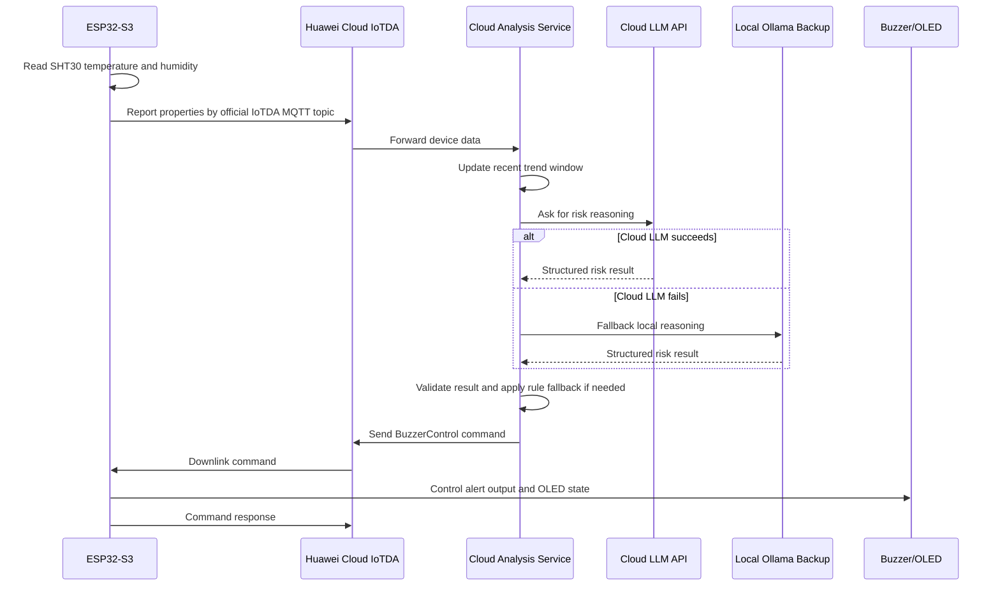

# Data Flow

This document describes the end-to-end flow from sensor data collection to buzzer alert.

## Main Closed Loop

```text
ESP32-S3
  -> SHT30 temperature and humidity reading
  -> IoTDA official property report
  -> Huawei Cloud IoTDA
  -> data forwarding rule
  -> cloud analysis service
  -> cloud LLM reasoning
  -> IoTDA command downlink
  -> ESP32-S3 buzzer/GPIO alert
```

## Step-by-Step Flow

1. ESP32-S3 reads SHT30.
2. ESP32-S3 formats data using IoTDA official property report structure.
3. ESP32-S3 publishes to:

```text
$oc/devices/{device_id}/sys/properties/report
```

4. IoTDA receives and stores the device property update.
5. IoTDA forwards the data to the cloud analysis service.
6. The cloud service updates the recent data window.
7. The cloud service sends the recent trend to the cloud LLM.
8. If the cloud LLM fails, the service tries local Ollama backup.
9. If LLM reasoning fails, the service uses rule thresholds.
10. The cloud service validates the final decision.
11. If alert is needed, the service calls IoTDA command downlink.
12. ESP32-S3 receives the command from:

```text
$oc/devices/{device_id}/sys/commands/#
```

13. ESP32-S3 controls buzzer/GPIO.
14. ESP32-S3 sends command execution response to:

```text
$oc/devices/{device_id}/sys/commands/response/request_id={request_id}
```

## Sequence Diagram



## Demo Flow

For a competition demo:

1. Show normal temperature and humidity on OLED.
2. Warm the sensor or increase humidity near the device.
3. ESP32-S3 reports changing readings to IoTDA.
4. IoTDA dashboard shows property updates.
5. Cloud analysis service shows recent trend and LLM result.
6. LLM classifies the risk as medium, high, or critical.
7. IoTDA downlinks `BuzzerControl`.
8. ESP32-S3 buzzer alerts and OLED displays warning state.

## Failure Handling

| Failure | Expected behavior |
|---|---|
| Cloud LLM API unavailable | Use local Ollama backup |
| Ollama unavailable | Use rule fallback |
| IoTDA command failure | Log and retry according to cloud service policy |
| Device offline | IoTDA shows device offline; cloud service should not assume command success |
| Sensor read failure | ESP32-S3 should display sensor error and avoid reporting invalid data |
